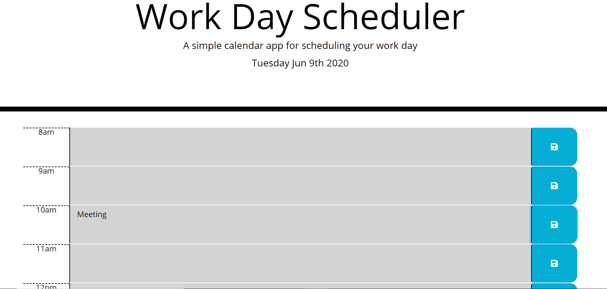

# Day-Planner
Wk 5 HW. A daily planner/scheduler
## Goals
* To create a daily planner based off average work day

* Have timeblocks for input of tasks

* Color code the tasks for past/present/future

* Have the event save to local storage

* Prevent the data from being cleared on refresh

## Improvements
The planner functions with the color changes and the input saves to local storage. 

On page refresh the data stays on page.

I'd like to add a clear day button. 

In the future I'd like the clear day button to be on individual hours as well as over the whole day.

